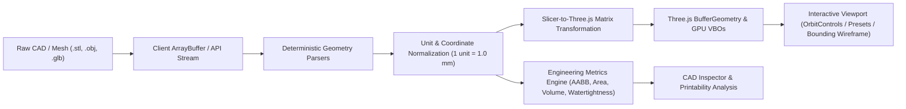

# Outlaw Forge — 3D Mesh & Geometry Pipeline Architecture

## 1. System Overview

Outlaw Forge treats 3D meshes as **deterministic engineering artifacts**. Every transformation, calculation, and render pass preserves geometry integrity without loss of numerical precision or silent unit mutations.

---

## 2. Coordinate Systems & Transformation Mathematics

### 2.1 Slicer Space (Z-Up Right-Handed) vs Three.js Space (Y-Up Right-Handed)

- **Slicer Space (Physical Reality & G-Code Standard)**:
  - $+X$: Right (Width, mm)
  - $+Y$: Back / Deep (Depth, mm)
  - $+Z$: Up / Build Height (Elevation, mm)
  - Origin $(0,0,0)$: Physical Front-Left corner of build plate (or Center for Delta printers).

- **Three.js Viewport Space**:
  - $+X$: Right
  - $+Y$: Up
  - $+Z$: Out of screen / Toward camera

### 2.2 Deterministic Transformation Matrix

The mapping from Slicer Space $(x_s, y_s, z_s)$ to Three.js Space $(x_t, y_t, z_t)$ is accomplished via a $-90^\circ$ ($-\pi/2$ rad) rotation about the X-axis:

$$\begin{bmatrix} x_t \\ y_t \\ z_t \\ 1 \end{bmatrix} = \begin{bmatrix} 1 & 0 & 0 & 0 \\ 0 & 0 & 1 & 0 \\ 0 & -1 & 0 & 0 \\ 0 & 0 & 0 & 1 \end{bmatrix} \begin{bmatrix} x_s \\ y_s \\ z_s \\ 1 \end{bmatrix}$$

$$\mathbf{M}_{\text{Slicer} \to \text{Three}} = \begin{bmatrix} 1 & 0 & 0 & 0 \\ 0 & 0 & 1 & 0 \\ 0 & -1 & 0 & 0 \\ 0 & 0 & 0 & 1 \end{bmatrix}, \quad \mathbf{M}_{\text{Three} \to \text{Slicer}} = \begin{bmatrix} 1 & 0 & 0 & 0 \\ 0 & 0 & -1 & 0 \\ 0 & 1 & 0 & 0 \\ 0 & 0 & 0 & 1 \end{bmatrix}$$

In React Three Fiber, all bed elements, models, and bounding envelopes are mounted under a root `<group rotation={[-Math.PI / 2, 0, 0]} name="SlicerSpaceRoot">`, ensuring all child coordinates are expressed natively in millimeter slicer space.

---

## 3. Supported Mesh Formats & Parsing

| Format | Specification | Loader Implementation | Memory Handling |
| :--- | :--- | :--- | :--- |
| **STL (Binary)** | IEEE 754 32-bit floats, 80-byte header, 50-byte facet records | `three-stdlib/STLLoader` | Direct `ArrayBuffer` typed array indexing |
| **STL (ASCII)** | Plaintext facet normal and vertex loop definitions | `three-stdlib/STLLoader` | Text parsing into `Float32Array` |
| **OBJ** | Wavefront geometric definition (`v`, `vn`, `vt`, `f`) | `three-stdlib/OBJLoader` | Hierarchy traverse & geometry merging |
| **GLTF / GLB** | JSON / Binary container with PBR material definitions | `three-stdlib/GLTFLoader` | Flattened scene mesh concatenation |
| **3MF** | OPC XML container with production slice data | `three-stdlib/3MFLoader` | Structured mesh group extraction |

---

## 4. Deterministic Geometry Algorithms

### 4.1 Axis-Aligned Bounding Box (AABB) in Millimeters
Computed from the vertex buffer attribute $\mathbf{V}$:
$$\text{min}_k = \min_{i} V_{i,k}, \quad \text{max}_k = \max_{i} V_{i,k}, \quad \Delta_k = |\text{max}_k - \text{min}_k| \quad (k \in \{x, y, z\})$$

### 4.2 Surface Area Calculation
For each triangle with vertices $\mathbf{v}_1, \mathbf{v}_2, \mathbf{v}_3$:
$$\mathbf{e}_1 = \mathbf{v}_2 - \mathbf{v}_1, \quad \mathbf{e}_2 = \mathbf{v}_3 - \mathbf{v}_1$$
$$\text{Area}_{\triangle} = \frac{1}{2} \|\mathbf{e}_1 \times \mathbf{e}_2\|$$
$$\text{Total Area (cm}^2\text{)} = 0.01 \times \sum_{i=1}^{N_{\text{tri}}} \text{Area}_{\triangle_i}$$

### 4.3 Signed Mesh Volume (Divergence Theorem)
$$\text{Vol}_{\triangle} = \frac{1}{6} \left( \mathbf{v}_1 \cdot (\mathbf{v}_2 \times \mathbf{v}_3) \right)$$
$$\text{Total Volume (cm}^3\text{)} = 0.001 \times \left| \sum_{i=1}^{N_{\text{tri}}} \text{Vol}_{\triangle_i} \right|$$

### 4.4 Watertight 2-Manifold Verification
A 3D surface is manifold and watertight if and only if:
1. Every undirected edge $\{v_a, v_b\}$ is shared by exactly **two** adjacent triangles.
2. In opposite topological traversal directions: $(v_a \to v_b)$ and $(v_b \to v_a)$.
3. No self-intersections or degenerate zero-area faces exist.

---

## 5. Camera Control & Viewport Architecture

### 5.1 CAD Preset Views
Presets position the camera at distance $D = \frac{\max(\Delta_x, \Delta_y, \Delta_z)}{2 \tan(\text{FOV} / 2)} \times \text{padding}$:
- **Isometric (`1`)**: Offset $(\Delta \cdot 0.707, \Delta \cdot 0.636, \Delta \cdot 0.707)$ looking at bounding box center.
- **Top (`2`)**: Offset $(0, +D, 0)$ looking down Z-axis.
- **Front (`3`)**: Offset $(0, 0, +D)$ looking along Y-axis.
- **Right (`4`)**: Offset $(+D, 0, 0)$ looking along X-axis.

### 5.2 Hotkey Bindings
- **`F`**: Frame active selection / mesh bounding volume.
- **`R`**: Reset camera to default isometric perspective.
- **`1`, `2`, `3`, `4`**: Instant transition to CAD orthogonal/isometric presets.
- **Left Mouse Drag**: Orbit rotation around target.
- **Right Mouse Drag / Shift + Left Drag**: Pan along screen plane.
- **Mouse Wheel**: Zoom in/out with clamped near/far bounds ($5 \text{ mm}$ to $3000 \text{ mm}$).
