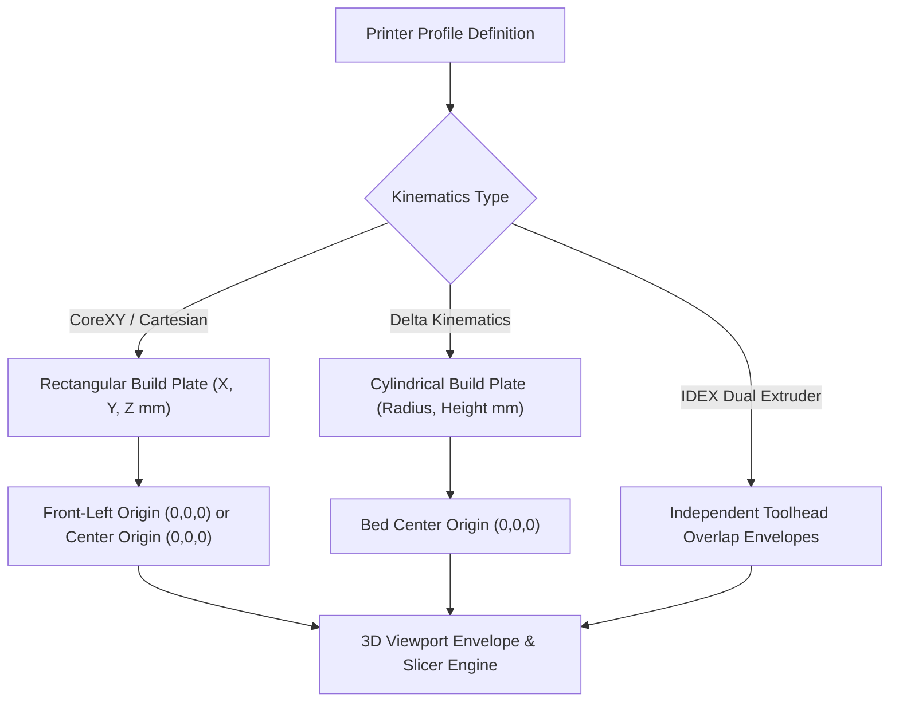

# Outlaw Forge — 3D Printer Profiles & Kinematics Specification

## 1. Kinematics Classification & Coordinate Framing

Outlaw Forge supports all major additive manufacturing motion kinematics systems. Each printer profile dictates the build volume envelope, coordinate frame origin, and toolhead travel boundaries.



---

## 2. Supported Kinematics Architectures

| Kinematics Type | Motion Mechanism | Origin Convention | Typical Machines |
| :--- | :--- | :--- | :--- |
| **CoreXY** | Stationary XY stepper motors driving crossed timing belts; Z-bed or flying gantry | Front-Left $(0,0,0)$ | Bambu Lab X1C/P1S, Voron 2.4/Trident, RatRig V-Core, Creality K1 |
| **Cartesian (Bed Slinger)** | Direct X on gantry, Y moves bed forward/back, Z elevates | Front-Left $(0,0,0)$ | Prusa MK4/MK3S+, Creality Ender 3, Bambu Lab A1 |
| **Delta** | 3 synchronized vertical towers with parallel diagonal pushrods | Center $(0,0,0)$ | Flsun V400/S1, Rostock Max, Kossel |
| **IDEX** | Two independent X-carriages sharing Y and Z axes | Front-Left $(0,0,0)$ | Snapmaker J1, BCN3D Sigma, Tenlog |

---

## 3. Built-In Verified Printer Profiles

### 3.1 Bambu Lab X1-Carbon / P1S / P1P
- **Kinematics**: CoreXY
- **Build Dimensions**: $256 \times 256 \times 256 \text{ mm}$
- **Origin**: Front-Left $(0,0,0)$
- **Nozzle Diameters**: $0.2, 0.4, 0.6, 0.8 \text{ mm}$
- **Max Toolhead Speed**: $500 \text{ mm/s}$
- **Max Toolhead Acceleration**: $20,000 \text{ mm/s}^2$
- **Max Volumetric Flow**: $32 \text{ mm}^3/\text{s}$ (Standard High-Flow Nozzle)
- **Keep-out Zones**:
  - Purge chute / waste collector: $X: [18, 64], Y: [248, 256]$
  - Bed leveling sensor wipe area: $X: [120, 136], Y: [250, 256]$

### 3.2 Prusa MK4 / MK3S+
- **Kinematics**: Cartesian (Bed Slinger)
- **Build Dimensions**: $250 \times 210 \times 220 \text{ mm}$
- **Origin**: Front-Left $(0,0,0)$
- **Nozzle Diameters**: $0.4 \text{ mm}$ (Standard Nextruder)
- **Max Speed**: $200 \text{ mm/s}$
- **Max Acceleration**: $4,000 \text{ mm/s}^2$

### 3.3 Voron 2.4 (350mm Variant)
- **Kinematics**: Flying Gantry CoreXY (4 independent Z-steppers)
- **Build Dimensions**: $350 \times 350 \times 350 \text{ mm}$
- **Origin**: Front-Left $(0,0,0)$
- **Nozzle Diameters**: $0.4, 0.6 \text{ mm}$ (Dragon HF / Rapido)
- **Max Speed**: $600 \text{ mm/s}$
- **Max Acceleration**: $30,000 \text{ mm/s}^2$

### 3.4 Flsun V400
- **Kinematics**: Delta (Tri-Tower)
- **Build Dimensions**: $\varnothing 300 \times 410 \text{ mm}$ (Diameter $\times$ Height)
- **Origin**: Bed Center $(0,0,0)$
- **Max Speed**: $400 \text{ mm/s}$
- **Max Acceleration**: $10,000 \text{ mm/s}^2$

---

## 4. Printer Profile JSON Schema

```json
{
  "$schema": "http://json-schema.org/draft-07/schema#",
  "title": "PrinterProfile",
  "type": "object",
  "required": [
    "id",
    "manufacturer",
    "model",
    "build_width_mm",
    "build_depth_mm",
    "build_height_mm",
    "nozzle_diameter_mm"
  ],
  "properties": {
    "id": { "type": "string", "example": "bambu-x1c" },
    "manufacturer": { "type": "string", "example": "Bambu Lab" },
    "model": { "type": "string", "example": "X1-Carbon" },
    "kinematics": { "type": "string", "enum": ["corexy", "cartesian", "delta", "idex"], "default": "corexy" },
    "origin_position": { "type": "string", "enum": ["front_left", "center"], "default": "front_left" },
    "build_width_mm": { "type": "number", "minimum": 10.0, "maximum": 2000.0 },
    "build_depth_mm": { "type": "number", "minimum": 10.0, "maximum": 2000.0 },
    "build_height_mm": { "type": "number", "minimum": 10.0, "maximum": 2000.0 },
    "nozzle_diameter_mm": { "type": "number", "default": 0.4 },
    "heated_bed": { "type": "boolean", "default": true },
    "max_bed_temp_c": { "type": "number", "default": 120 },
    "max_nozzle_temp_c": { "type": "number", "default": 300 },
    "max_speed_mms": { "type": "number", "default": 500 },
    "max_accel_mms2": { "type": "number", "default": 20000 },
    "keep_out_zones": {
      "type": "array",
      "items": {
        "type": "object",
        "properties": {
          "name": { "type": "string" },
          "min": { "type": "array", "items": { "type": "number" }, "minItems": 3, "maxItems": 3 },
          "max": { "type": "array", "items": { "type": "number" }, "minItems": 3, "maxItems": 3 }
        }
      }
    }
  }
}
```

---

## 5. Viewport Rendering Integration

When an active printer profile is loaded in `ViewportContainer`:
1. **Bed Geometry**: The build sheet mesh is sized to `[build_width_mm, build_depth_mm, 1]`.
2. **Dual-Frequency Grid**:
   - Minor subdivisions rendered at $1.0 \text{ mm}$ intervals.
   - Major structural sections rendered at $10.0 \text{ mm}$ intervals with high-contrast accent lines.
3. **Print Volume Envelope**: A translucent bounding box wireframe is rendered at `[build_width_mm, build_depth_mm, build_height_mm]` centered at $(W/2, D/2, H/2)$ in slicer space.
4. **Origin Triad**: Rendered with standard CAD axis colors: $+X$ (Red), $+Y$ (Green), $+Z$ (Blue).
