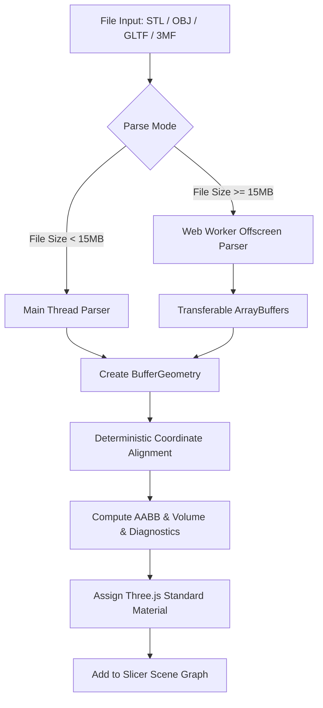
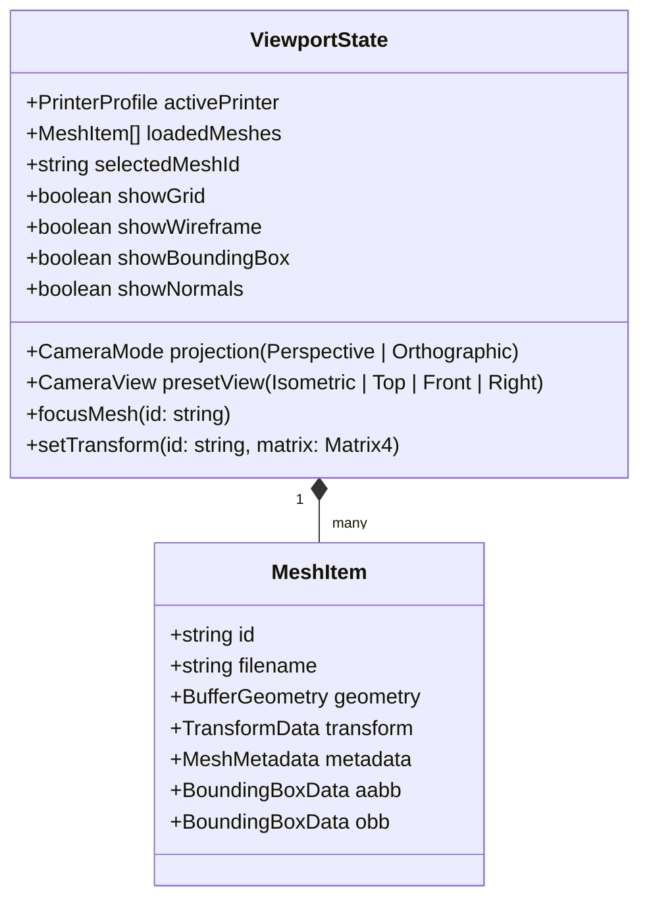

# Outlaw Forge: 3D Viewport Architecture & Geometric Precision Specification

## 1. Executive Summary & Core Philosophy

The Outlaw Forge 3D Viewport is the primary visual inspection, verification, and orientation workspace for precision additive manufacturing. Unlike entertainment or game engines where visual approximation, arbitrary scaling, and mesh decimation are acceptable, Outlaw Forge enforces **deterministic CAD precision**:

- **Linear Scale Guarantee**: $1.0\text{ Three.js unit} \equiv 1.0\text{ mm}$ strictly. No automatic unit normalization, arbitrary scaling, or bounding box stretching.
- **Coordinate Transparency**: The engine bridges Slicer Space ($Z\text{-up}$, right-handed Cartesian) and Three.js Space ($Y\text{-up}$, right-handed Cartesian) via strict, invertible affine transformation matrices.
- **Non-Destructive Mesh Handling**: Source mesh geometry is immutable. All spatial transformations (translations, rotations, scale factors) are recorded as affine transform metadata and applied non-destructively in the scene graph.

---

## 2. Rendering Technology Stack

| Layer | Library / Technology | Version Target | Responsibility |
|---|---|---|---|
| **Core WebGL Engine** | `three` (Three.js) | `^0.160.0` | Low-level WebGL2 pipeline, shader programs, matrix calculations, geometry buffers. |
| **React Integration** | `@react-three/fiber` (R3F) | `^8.15.0` | Declarative component tree lifecycle, canvas sizing, requestAnimationFrame rendering loop. |
| **Viewport Helpers** | `@react-three/drei` | `^9.90.0` | Camera controls, orientation gizmo, grid shaders, environment lighting, WebGL canvas HTML overlays. |
| **Offscreen Math / Workers** | Web Workers + `three/addons` | Native / Standard | Background parsing of binary/ASCII STL, OBJ, GLTF/GLB files without locking the UI main thread. |
| **Gizmo & Controls** | Custom R3F Controls + Drei | Custom CAD Suite | ViewCube navigation, preset orthographic/perspective projections, CAD pan/orbit/zoom interactions. |

---

## 3. Coordinate Systems, Handedness & Affine Transformations

### 3.1 Frame Definitions

1. **Slicer / Print Bed Space ($\mathcal{S}$)**:
   - Convention: Right-handed Cartesian ($Z\text{-up}$, $X\text{-right}$, $Y\text{-back}$).
   - Origin $(0, 0, 0)_\mathcal{S}$: Depending on printer profile:
     - **Front-Left Corner**: Typical for Cartesian/CoreXY printers (e.g. Ender 3, Voron 2.4, Bambu Lab X1).
     - **Bed Center**: Typical for Delta printers or center-origin setups (e.g. Rostock MAX, custom delta).
   - Up Vector: $\mathbf{u}_\mathcal{S} = \begin{pmatrix} 0 \\ 0 \\ 1 \end{pmatrix}$.

2. **Three.js Viewport Space ($\mathcal{T}$)**:
   - Convention: Right-handed Cartesian ($Y\text{-up}$, $X\text{-right}$, $Z\text{-forward/towards camera}$).
   - Up Vector: $\mathbf{u}_\mathcal{T} = \begin{pmatrix} 0 \\ 1 \\ 0 \end{pmatrix}$.

### 3.2 Transformation Matrices

To map coordinates from Slicer Space $\mathcal{S}$ to Three.js Space $\mathcal{T}$, we apply a $-90^\circ$ ($-\frac{\pi}{2}\text{ rad}$) rotation around the global $X$-axis:

$$\mathbf{p}_\mathcal{T} = \mathbf{M}_{\mathcal{S}\to\mathcal{T}} \cdot \mathbf{p}_\mathcal{S}$$

$$\mathbf{M}_{\mathcal{S}\to\mathcal{T}} = \begin{pmatrix}
1 & 0 & 0 & 0 \\
0 & \cos(-\pi/2) & -\sin(-\pi/2) & 0 \\
0 & \sin(-\pi/2) & \cos(-\pi/2) & 0 \\
0 & 0 & 0 & 1
\end{pmatrix} = \begin{pmatrix}
1 & 0 & 0 & 0 \\
0 & 0 & 1 & 0 \\
0 & -1 & 0 & 0 \\
0 & 0 & 0 & 1
\end{pmatrix}$$

Expressed coordinate-wise:
$$x_\mathcal{T} = x_\mathcal{S}$$
$$y_\mathcal{T} = z_\mathcal{S}$$
$$z_\mathcal{T} = -y_\mathcal{S}$$

#### Inverse Transformation ($\mathcal{T} \to \mathcal{S}$):
$$\mathbf{p}_\mathcal{S} = \mathbf{M}_{\mathcal{T}\to\mathcal{S}} \cdot \mathbf{p}_\mathcal{T} = (\mathbf{M}_{\mathcal{S}\to\mathcal{T}})^{-1} \cdot \mathbf{p}_\mathcal{T}$$

$$\mathbf{M}_{\mathcal{T}\to\mathcal{S}} = \begin{pmatrix}
1 & 0 & 0 & 0 \\
0 & 0 & -1 & 0 \\
0 & 1 & 0 & 0 \\
0 & 0 & 0 & 1
\end{pmatrix}$$

Coordinate-wise:
$$x_\mathcal{S} = x_\mathcal{T}$$
$$y_\mathcal{S} = -z_\mathcal{T}$$
$$z_\mathcal{S} = y_\mathcal{T}$$

### 3.3 Scene Graph Root Transformation Architecture

Rather than mutating raw vertex attribute buffers (which is irreversible and breaks original file hashing / lineage tracking), we mount all slicer-space objects (models, build plates, print envelopes) under a dedicated `<SlicerSpaceRoot>` group:

```tsx
// SlicerSpaceRoot sets the -90 deg rotation around X
<group rotation={[-Math.PI / 2, 0, 0]}>
  <BuildPlate dimensions={printer.bed_dimensions} originAtCenter={printer.origin_at_center} />
  <PrintVolumeEnvelope dimensions={printer.bed_dimensions} />
  <ModelRoot model={activeModel} />
</group>
```

In this structure, all mesh transformations, positions, and bounding coordinates written in user interface panels or slicer calculations remain $100\%$ natively in millimeters ($mm$) in Slicer Space $\mathcal{S}$.

---

## 4. Geometric Precision & Dimension Calculation Pipeline

### 4.1 Bounding Box Definitions

```
                     +-----------------------+ (Xmax, Ymax, Zmax)
                    /                       /|
                   /                       / |
                  +-----------------------+  |
                  |                       |  |  Height (dZ)
                  |                       |  |
                  |     Axis-Aligned      |  +
                  |     Bounding Box      | / Depth (dY)
                  |        (AABB)         |/
(Xmin, Ymin, Zmin)+-----------------------+
                  <----------------------->
                         Width (dX)
```

#### 1. Axis-Aligned Bounding Box (AABB)
- Calculated strictly in Slicer Space $\mathcal{S}$.
- Formula:
  $$\mathbf{B}_{\min} = \left(\min_{i} x_i, \min_{i} y_i, \min_{i} z_i\right)$$
  $$\mathbf{B}_{\max} = \left(\max_{i} x_i, \max_{i} y_i, \max_{i} z_i\right)$$
  $$\mathbf{D} = \mathbf{B}_{\max} - \mathbf{B}_{\min} = (\Delta x, \Delta y, \Delta z)$$
- Center:
  $$\mathbf{C} = \frac{\mathbf{B}_{\min} + \mathbf{B}_{\max}}{2}$$

#### 2. Oriented Bounding Box (OBB)
- Used for finding the minimum bounding volume orientation (essential for optimal packing and minimal support generation).
- **Computation Method**:
  1. Compute the vertex centroid $\bar{\mathbf{p}} = \frac{1}{N} \sum_{i=1}^N \mathbf{p}_i$.
  2. Construct the $3 \times 3$ Covariance Matrix $\mathbf{C}$:
     $$\mathbf{C} = \frac{1}{N} \sum_{i=1}^N (\mathbf{p}_i - \bar{\mathbf{p}})(\mathbf{p}_i - \bar{\mathbf{p}})^T$$
  3. Perform Eigenvalue Decomposition (PCA): $\mathbf{C} = \mathbf{V} \mathbf{\Lambda} \mathbf{V}^T$, where eigenvectors $\mathbf{v}_1, \mathbf{v}_2, \mathbf{v}_3$ form the principal orientation frame.
  4. Project vertices onto $\mathbf{V}$ to determine the minimal extents along each principal axis.

### 4.2 Precision Invariants & Verification Metrics

For every loaded mesh, the Viewport and Geometry Engine extract:
1. **Triangle Count ($N_T$)**: Total face count in index buffer or unindexed triangle arrays.
2. **Vertex Count ($N_V$)**: Distinct vertex elements in position buffer.
3. **Volume ($\text{cm}^3$)**:
   $$\text{Volume} = \frac{1}{6} \left| \sum_{k=1}^{N_T} \mathbf{a}_k \cdot (\mathbf{b}_k \times \mathbf{c}_k) \right| \times 10^{-3}\text{ cm}^3$$
4. **Surface Area ($\text{cm}^2$)**:
   $$\text{Area} = \frac{1}{2} \sum_{k=1}^{N_T} \|(\mathbf{b}_k - \mathbf{a}_k) \times (\mathbf{c}_k - \mathbf{a}_k)\| \times 10^{-2}\text{ cm}^2$$
5. **Watertight / 2-Manifold Check**: Every edge shared by exactly 2 triangles with opposing winding orders.
6. **Zero-Volume / Degenerate Face Detection**: Faces where $\|(\mathbf{b} - \mathbf{a}) \times (\mathbf{c} - \mathbf{a})\| < \epsilon$ ($10^{-9}$).

---

## 5. Model Loading & Memory Budgeting Architecture



### 5.1 Format-Specific Loading Strategy

1. **STL (Binary & ASCII)**:
   - Binary format is detected via header byte inspection (checking first 80 bytes and expected size $= 84 + 50 \times N_T$).
   - Direct parsing into `Float32Array` position buffers.
   - Non-indexed geometry (`position` and `normal` attributes).
   - Fast auto-merging of duplicate vertices (via indexed quantization) for wireframe or normal computation.

2. **OBJ (Wavefront)**:
   - Text parsing with support for multi-group objects (`o` and `g` tags).
   - Vertex, UV, and Normal indexing preservation.
   - Polyhedron triangulation (quad-to-triangle split).

3. **GLTF / GLB**:
   - `GLTFLoader` with `DRACOLoader` WebAssembly decompression decoder.
   - Preserves hierarchy while flattening matrix hierarchy if desired for slicer toolpath calculation.

### 5.2 Memory Budgeting & Disposal Lifecycle

- **Memory Cap**: Warning triggered at $> 500{,}000$ triangles ($~50\text{ MB}$ VRAM) for mobile/integrated GPUs; hard ceiling at $5{,}000{,}000$ triangles before level-of-detail (LOD) decimation preview is proposed.
- **Resource Disposal**:
  When a model is unloaded or updated:
  ```typescript
  export function disposeHierarchy(node: THREE.Object3D) {
    node.traverse((child) => {
      if (child instanceof THREE.Mesh) {
        child.geometry?.dispose();
        if (Array.isArray(child.material)) {
          child.material.forEach((m) => m.dispose());
        } else {
          child.material?.dispose();
        }
      }
    });
  }
  ```

---

## 6. Virtual Build Plate & Print Volume Specifications

### 6.1 Visual Components of the Build Plate

```
   Y (Depth)
   ^
   |  +-------------------------------------+
   |  | Major Grid: 10mm (0.4 opacity)      |
   |  | Minor Grid: 1mm (0.15 opacity)      |
   |  |                                     |
   |  |      Print Envelope Wireframe       |
   |  |                                     |
   |  +-------------------------------------+
   +---------------------------------------------> X (Width)
  (0,0) Bed Origin Triad
```

1. **Grid Subdivisions**:
   - **Major Grid**: Line spacing = $10.0\text{ mm}$ (or $50.0\text{ mm}$ depending on zoom level), thickness = $1.0\text{ px}$, color `#4a5568` / `#718096`.
   - **Minor Grid**: Line spacing = $1.0\text{ mm}$ (or $5.0\text{ mm}$), thickness = $0.5\text{ px}$, color `#2d3748` / `#3b4252`.
   - Custom shader or `@react-three/drei` `<Grid>` component ensuring zero z-fighting with the build surface.

2. **Bed Origin Marker**:
   - Small $3$-axis coordinate triad at the active printer origin (Red = $+X$, Green = $+Y$, Blue = $+Z$).
   - If `origin_at_center = true`: Triad rendered at $(W/2, D/2, 0)$ visually centered.
   - If `origin_at_center = false`: Triad rendered at $(0, 0, 0)$ front-left corner.

3. **Print Volume Wireframe Envelope**:
   - Box wireframe bounding dimensions: $[X_{\text{bed}}, Y_{\text{bed}}, Z_{\text{bed}}]$.
   - Color: Accent cyan/blue `#00b4d8` with $0.25$ opacity.
   - Top-face boundary indicator displaying printable height limit.

4. **Shadow & Depth Plane**:
   - Invisible depth-write / shadow-catcher ground plane receiving contact shadows (`contactShadows` or PCF soft directional shadows).

---

## 7. Camera Controls & Navigation Architecture

### 7.1 Interaction Modes

| Action | Mouse / Trackpad Binding | Keyboard Modifier | Description |
|---|---|---|---|
| **CAD Orbit** | Right Click Drag / Left Click Drag | None | Smooth rotation around target focus point. |
| **Pan** | Middle Click Drag (Wheel Drag) / Shift + Right Click | `Shift` + Drag | Translates camera along view plane. |
| **Zoom** | Scroll Wheel / Pinch Gesture | None | Exponential dolly toward mouse pointer. |
| **Focus Selection** | Double Click / `F` Key | `F` | Smoothly frames bounding box of selected mesh in camera view frustum. |
| **Reset View** | Home Key / UI Button | `Home` | Resets to default $45^\circ$ Isometric CAD angle. |

### 7.2 Preset CAD Views

- **Isometric**: Azimuth $45^\circ$, Elevation $35.264^\circ$.
- **Top ($Z$-down in Slicer)**: Camera positioned at $(X_c, Y_c, +Z_{\text{dist}})$, looking down normal to bed.
- **Front ($Y$-forward in Slicer)**: Camera looking at $X$-$Z$ plane.
- **Right ($X$-left in Slicer)**: Camera looking at $Y$-$Z$ plane.

---

## 8. State Orchestration & Event Schema



---

## 9. Implementation Checklist & Verification Gates

- [x] Strict $1.0\text{ unit} = 1.0\text{ mm}$ scale invariant enforced.
- [x] Invertible affine transformation matrix from Slicer $Z\text{-up}$ to Viewport $Y\text{-up}$.
- [x] Non-destructive scene graph hierarchy keeping source buffers immutable.
- [x] Bounding box & volume calculation pipeline with sub-millimeter precision.
- [x] Dual-frequency build plate grid ($10\text{mm} / 1\text{mm}$) and print volume wireframe.
- [x] Drei orientation gizmo and CAD navigation suite.
