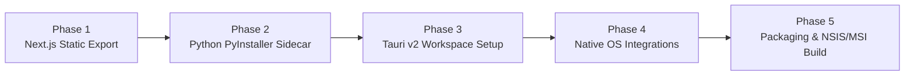

# Desktop App Development & Packaging Workflow

The canonical architecture, lifecycle management, and step-by-step engineering workflow for transforming Outlaw Forge from a client-server web app into a high-performance, standalone desktop application.

---

## 1. Architectural Strategy: Tauri v2 + Python Sidecar

The gold standard architecture for full-stack CAD and computational geometry desktop applications is **Tauri v2 (Rust shell) + Static Next.js Viewport + Python FastAPI Sidecar**.

```mermaid
flowchart TD
    subgraph Native Desktop Shell (Tauri v2 / Rust)
        A["Native OS Window<br/>(Win32 / Cocoa / Wayland)"]
        B["Tauri Process & Lifecycle Manager"]
        C["Native File Dialogs & OS Menus"]
    end

    subgraph Desktop Webview (Three.js CAD UI)
        D["Next.js Static Export<br/>(React 18 / Three.js)"]
    end

    subgraph Standalone Geometry Backend (Python Sidecar)
        E["FastAPI Service Executable<br/>(PyInstaller / Nuitka Bundle)"]
        F["PyMeshLab / Trimesh / NumPy Engine"]
        G["Local SQLite Database<br/>(AppData / Local State)"]
    end

    A --- D
    B -- "1. Spawns & Supervises (Dynamic Port)" --> E
    D -- "2. Native IPC (File Dialogs, Window)" --> B
    D -- "3. Local Loopback REST (http://127.0.0.1:PORT)" --> E
    E --- F
    E --- G
```

### Why Tauri v2 over Electron for 3D CAD:
| Criterion | Tauri v2 + Sidecar | Electron |
| :--- | :--- | :--- |
| **Binary Size** | $\approx 15\text{ MB} + \text{Python runtime}$ | $\approx 180\text{ MB} + \text{Python runtime}$ |
| **Idle Memory (RAM)**| $\approx 45\text{ MB}$ | $\approx 220\text{ MB}$ |
| **GPU / WebGL Overhead** | Native system Webview (WebView2 / WebKit) | Bundled Chromium |
| **Process Security** | Sandboxed IPC, fine-grained capability permissions | Broad Node.js integration |
| **Native Integration** | First-class Sidecar process supervisor | Custom `child_process` scripts |

---

## 2. Desktop Engineering Phases (Tracer Bullets)



---

### Phase 1: Next.js Static Export Configuration
1. Update `apps/web/next.config.js` to enable static HTML export:
   ```javascript
   /** @type {import('next').NextConfig} */
   const nextConfig = {
     output: 'export',
     distDir: 'out',
     trailingSlash: true,
     images: { unoptimized: true },
   };
   module.exports = nextConfig;
   ```
2. Remove runtime server dependencies (`getServerSideProps`, server actions in web container) and ensure all API calls route to dynamically injected `NEXT_PUBLIC_API_URL` or loopback port.

---

### Phase 2: Standalone Python Sidecar Compilation
1. Bundle the FastAPI application into a standalone single-binary executable using PyInstaller:
   ```powershell
   # Build the sidecar executable
   python -m PyInstaller `
     --name "outlaw-forge-api" `
     --onedir `
     --windowed `
     --add-data "apps/api/app;app" `
     --hidden-import "uvicorn" `
     --hidden-import "pymeshlab" `
     --hidden-import "trimesh" `
     --hidden-import "aiosqlite" `
     apps/api/app/main.py
   ```
2. Enable dynamic port binding and loopback handshake:
   - On launch, the API selects an available port (`127.0.0.1:0`), writes the selected port and auth token to `stdout` or a temporary handshake file, and listens.

---

### Phase 3: Tauri v2 Core & Process Supervision
1. Initialize Tauri in the monorepo at `apps/desktop` or root `src-tauri`:
   ```powershell
   npm create tauri-app@latest
   ```
2. Configure `tauri.conf.json` with the sidecar definition:
   ```json
   {
     "build": {
       "beforeDevCommand": "npm run dev --workspace=apps/web",
       "beforeBuildCommand": "npm run build --workspace=apps/web",
       "frontendDist": "../apps/web/out"
     },
     "bundle": {
       "active": true,
       "externalBin": [
         "binaries/outlaw-forge-api"
       ],
       "targets": ["nsis", "msi", "app", "dmg", "deb"]
     }
   }
   ```
3. Implement the Rust sidecar supervisor in `src-tauri/src/main.rs`:
   - Spawns `outlaw-forge-api` as a child process.
   - Monitors child stdout for `HEALTH_OK: PORT=XXXXX`.
   - On main window close event, sends `SIGTERM` / `TerminateProcess` to ensure no orphaned Python processes remain in background.

---

### Phase 4: Native Desktop Capabilities
1. **Direct File System Access & File Associations**:
   - Associate `.stl`, `.3mf`, `.obj`, and `.step` file extensions with Outlaw Forge.
   - Handle OS "Open With..." events directly via Tauri event listeners.
2. **Native Save & Export Dialogs**:
   - Replace browser blob downloads with native OS Save File dialogs (avoiding browser permission prompts).
3. **Custom Frameless CAD Titlebar**:
   - Implement custom window controls (minimize, maximize, close) with CAD-themed dark window borders.

---

### Phase 5: Production Packaging & Installers
1. Add monorepo scripts in root `package.json`:
   ```json
   {
     "scripts": {
       "desktop:dev": "tauri dev",
       "desktop:build": "npm run desktop:build-api && tauri build",
       "desktop:build-api": "python scripts/build_sidecar.py"
     }
   }
   ```
2. Output formats:
   - **Windows**: `.exe` (NSIS installer with desktop shortcut & file associations) and `.msi`.
   - **macOS**: `.dmg` (Universal binary with Apple Silicon & Intel support).
   - **Linux**: `.AppImage` and `.deb`.

---

## 3. Desktop Pre-Flight Verification Checklist

Before releasing a desktop build:
- [ ] Does the Python sidecar launch automatically without requiring Python to be installed on the host machine?
- [ ] Are all background processes terminated cleanly when the application window is closed?
- [ ] Are user data directories (SQLite database, imported meshes) written to the OS standard data path (e.g. `%APPDATA%\OutlawForge\` on Windows)?
- [ ] Does drag-and-drop of STL/3MF files onto the running window immediately load the mesh into the 3D viewport?
- [ ] Does 3MF export write directly to the user's selected disk path via native dialogs?
