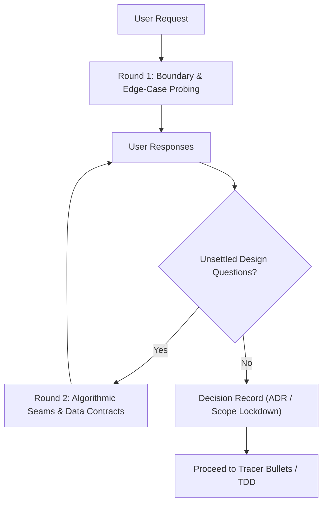

# Requirement Grilling & Socratic Stress-Testing

A mandatory pre-coding interview protocol for Outlaw Forge features and architectural changes. Prevents premature implementation, clarifies geometry edge cases, and stress-tests assumptions.

---

## 1. Core Philosophy

> **Rule:** *Facts are the agent's job; decisions are the user's.*

When a user proposes a feature or architectural modification, the agent must not immediately generate code. Vague specifications lead to broken geometry, edge-case regressions, and wasted iterations.

---

## 2. The Grilling Protocol

When initiating non-trivial tasks, run the Socratic interview in rounds:



### Round 1: Geometry & Physical Boundary Probing
Always evaluate:
1. **Physical & Dimensional Limits**:
   - What happens if the input mesh exceeds the printer's build volume?
   - What is the minimum wall thickness tolerance (e.g., $0.8\,\text{mm}$)?
2. **Mesh Topology Edge Cases**:
   - What happens if the input is non-manifold, contains self-intersections, has degenerate zero-area faces, or has inverted normals?
   - Should the operation heal automatically, warn the user, or abort with a structured error payload?
3. **Asset Immutability**:
   - Will this operation overwrite an existing working revision or spawn a new intermediate revision in `data/working/`?

### Round 2: Data Contracts & Interface Seams
Always evaluate:
1. **API Schema Alignment**:
   - What is the exact Pydantic schema in `apps/api`?
   - What is the corresponding TypeScript interface in `packages/shared`?
2. **Computational Budget & Vectorization**:
   - Can this mesh operation be computed synchronously ($\le 500\text{ms}$) or does it require background job execution / progress polling?
   - Is the geometry algorithm vectorized with NumPy / PyMeshLab / Trimesh, or is it an expensive Python loop?

---

## 3. Grilling Anti-Patterns to Avoid

- ❌ **The Multi-Question Firehose**: Do not dump 15 disjointed questions at once. Group them into 2-3 focused thematic questions per round.
- ❌ **Asking for Trivials**: Do not ask the user for basic facts that can be determined by reading existing codebase files or tests.
- ❌ **Assuming Sane Defaults for Geometry**: Never assume a mesh is watertight or oriented correctly without explicit checks.

---

## 4. Output: Decision Record

Once the interview completes, summarize the outcome in a brief Decision Record before writing code:
```markdown
### Feature Decision Record: [Feature Name]
- **Target Seam**: [e.g., `apps/api/app/services/mesh_repair.py` + `packages/shared/src/repair.ts`]
- **Edge-Case Strategy**: [e.g., Non-manifold edges automatically closed via PyMeshLab hole-filling]
- **Storage Policy**: [e.g., Writes new revision `data/working/{project_id}_{rev}.stl`]
- **Verification Criterion**: [e.g., Automated Pytest with degenerate prism fixture + UI toggle test]
```
