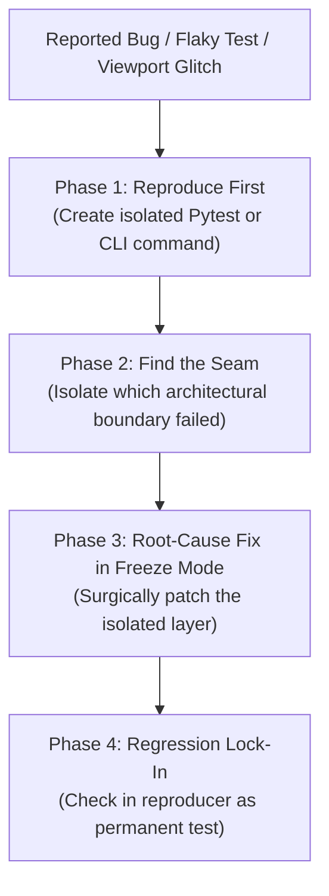

# Zero-Theorizing Investigation Protocol

The mandatory debugging and troubleshooting protocol for Outlaw Forge. Prohibits speculative code edits, enforces reproducible test loops, and locks down root-cause fixes with permanent regression tests.

---

## 1. The Core Rule

> **Rule:** *Never theorize, guess, or modify code until a deterministic reproducer exists.*

Speculative debugging in 3D geometry and multi-layer monorepos leads to cascading bugs, matrix drift, and broken coordinate frames.

---

## 2. The 4-Phase Investigation Workflow



### Phase 1: Reproduce First
- Create a minimal reproducer test file or single runnable CLI command:
  ```powershell
  # Example reproducer
  python -m pytest apps/api/tests/test_mesh_slicing.py -k "test_degenerate_face_reproducer"
  ```
- If the bug is a 3D viewport rendering glitch, create a minimal Three.js test scene or isolated component harness.
- Confirm the reproducer reliably fails (**RED**).

### Phase 2: Find the Seam
Trace the exact boundary where data invariants broke:
1. **File Parsing & Loaders**: Did the STL/OBJ loader misparse face normals or vertex indices?
2. **Matrix Transforms**: Did a rotation/scale matrix fail to update bounding boxes or apply non-uniform scaling?
3. **Coordinate Inversion**: Did a $Z$-up to $Y$-up coordinate swap invert winding order or normals?
4. **Database State / Transactions**: Did SQLite fail to record intermediate revision IDs?
5. **Three.js Scene-Graph Desync**: Did React component re-rendering create orphaned Three.js geometries or memory leaks?

### Phase 3: Root-Cause Fix in Freeze Mode
- Enter **Freeze Mode**: Restrict edits strictly to the offending module (e.g., `apps/api/app/services/slicer.py`).
- Do not refactor adjacent files or change API contracts while fixing the bug.
- Apply the minimal surgical fix until the reproducer passes (**GREEN**).

### Phase 4: Regression Lock-In
- Convert the reproducer into a permanent test in `apps/api/tests/` or `tests/`.
- Ensure the full test suite passes:
  ```powershell
  npm run test:backend
  npm run lint
  npm run build
  ```
