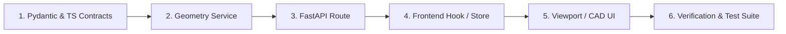

# Tracer Bullets & TDD Feature Development

The canonical step-by-step engineering discipline for building new features and geometry operations in Outlaw Forge.

---

## 1. The Tracer Bullet Lifecycle

Features are implemented in strict vertical order. Do not build disconnected layers in parallel. Build one complete end-to-end slice that pierces all architectural layers before expanding.

---

## 2. Step-by-Step Implementation Flow

### Step 1: Pydantic & TypeScript Contract Synchronization
1. Define the request and response models in `apps/api/app/schemas/`.
2. Mirror the contract identically in `packages/shared/src/` types.
3. Verify type-checks pass across both:
   - Python: Strict Pydantic v2 validation.
   - TypeScript: Run `npm run lint` or `tsc --noEmit`.

### Step 2: Geometry Engine Service (FastAPI / Trimesh / PyMeshLab)
1. Write the service logic in `apps/api/app/services/`.
2. Maintain strict vectorization (NumPy / Trimesh matrix ops).
3. Ensure immutability:
   - Read source from `data/uploads/` or `data/working/`.
   - Write new derived artifact to `data/working/{file_id}_{operation}.stl`.
4. Clean up any temporary files created during processing.

### Step 3: API Endpoint & Route Registration
1. Expose the service via FastAPI router in `apps/api/app/api/v1/`.
2. Attach structured error handlers (`HTTPException`) for invalid geometries.
3. Validate OpenAPI documentation updates at `/api/v1/docs`.

### Step 4: Frontend State & API Integration
1. Add typed API fetchers in `apps/web/` using the contracts from `@outlaw-forge/shared`.
2. Connect state via custom React hooks in `apps/web/hooks/`.
3. Handle loading states, progress bars, and geometry error toasts.

### Step 5: Three.js Viewport & Workbench Controls
1. Create or update UI controls in `apps/web/components/workbench/`.
2. Sync mesh updates to Three.js scene graphs via `packages/three-tools`.
3. Ensure coordinates, normals, and bounding boxes reflect in millimeter readouts.

### Step 6: Automated Verification (Red-Green TDD)
1. **Backend Unit & Integration Tests**:
   - Write tests in `apps/api/tests/` using test fixtures (e.g., sample STL/OBJ files).
   - Test both happy path and malformed mesh edge cases.
   - Run `npm run test:backend`.
2. **Frontend & Type Verification**:
   - Run `npm run lint` and `npm run build`.
3. **Black-Box Smoke Tests**:
   - Verify health and live endpoints via `npm run test:smoke`.
